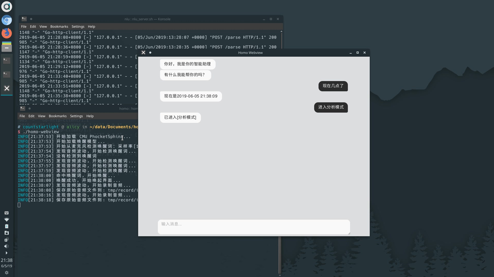

Homo
======== 

一个高性能，易于扩展且完全开源的自然交互系统

除语音合成和语音识别调用在线API，其余模块的训练或运行过程均不依赖任何形式的在线服务

模块均基于完全开源的库实现，所有训练过程和运行过程均采用完全开源的工具集和开放的数据集

**演示视频(BiliBili)：**

https://www.bilibili.com/video/av54654613

[](https://www.bilibili.com/video/av54654613)

**功能**

* 离线唤醒
  * 基于开源轻量级语音识别引擎[PocketSphinx](https://github.com/cmusphinx/pocketsphinx)实现
  * 使用开源工具集[CMUCLMTK](http://www.speech.cs.cmu.edu/SLM/toolkit_documentation.html)用于语言模型训练
  * 包含全部的训练数据集，工具集参数配置和预训练模型
* 在线语音识别
  * 调用百度在线语音识别和语音合成API
  * 计划加入更多平台支持
* (可选)本地离线语音识别：
  * 采用开源语音识别工具集[Kaldi](https://github.com/kaldi-asr/kaldi)
  * 使用清华大学30小时的数据集`thchs30`配置及训练
  * 使用AI SHELL公司开源178小时中文语音语料置及训练
  * 使用cvte预训练模型
* 语音合成：调用百度在线API
* 自然语言理解
  * 基于开源自然语言理解框架[Rasa NLU](https://github.com/RasaHQ/rasa)实现
  * 采用完全开源免费的公共数据集作为语料进行训练
  * 采用开源信息提取工具集[MITIE](https://github.com/mit-nlp/MITIE)构建用于Rasa NLU进行实体识别和意图识别的模型
  * 意图识别分类采用开源机器学习框架[scikit-learn](https://github.com/scikit-learn/scikit-learn)
  * 中文分词采用开源分词组件[jieba](https://github.com/fxsjy/jieba)
* 情感分析
  * 基于支持向量机(SVM)算法进行情感极性分析
  * word2vec模型构建采用开源主题建模工具[Gensim](https://github.com/RaRe-Technologies/gensim)
  * (可选)基于逻辑回归(Logistic Regression)算法的情感极性分类器实现


**目录**

<!-- TOC -->

- [配置运行](#配置运行)
    - [1. 系统支持](#1-系统支持)
    - [2. 安装依赖](#2-安装依赖)
        - [2.1 系统依赖](#21-系统依赖)
            - [2.1.1 PortAudio](#211-portaudio)
            - [2.1.2 CMUSphinx](#212-cmusphinx)
        - [2.2 Python依赖](#22-python依赖)
    - [3. 编译](#3-编译)
- [4. 运行](#4-运行)
    - [4.1 运行自然语言理解引擎](#41-运行自然语言理解引擎)
    - [4.2 运行文本情感分析引擎](#42-运行文本情感分析引擎)
    - [4.3 运行主程序](#43-运行主程序)
- [文件结构](#文件结构)
- [开发文档](#开发文档)
    - [1. 离线唤醒实现](#1-离线唤醒实现)
    - [2. 自然语言理解实现](#2-自然语言理解实现)
    - [3. 文本情感分析实现](#3-文本情感分析实现)

<!-- /TOC -->

# 配置运行

## 1. 系统支持

理论上跨平台，但推荐使用Linux，没有在Macos上进行过测试，一些依赖库在Windows系统上配置可能相当繁琐

## 2. 安装依赖

### 2.1 系统依赖

#### 2.1.1 PortAudio

录制声音依赖 `portaudio`

使用 Go 的 `portaudio`绑定 [portaudio-go](https://github.com/xlab/portaudio-go)，参照对应的文档配置好依赖

注意：Archlinux需要安装 `pulseaudio-alsa` 使得和 `pulseaudio` 一起工作时不会造成崩溃

#### 2.1.2 CMUSphinx

基于 `CMUSphinx` 实现离线唤醒和语音录制

使用 Go 的 `CMUSphinx` 绑定 [pocketsphinx-go](https://github.com/xlab/pocketsphinx-go)，参照对应的文档配置好依赖

### 2.2 Python依赖

情感分析和自然语言理解部分主要由Python实现，需要安装用到的依赖库，推荐使用`virtualenv`

Python版本推荐使用`3.6.8`

```bash
cd homo/sentiment
# 创建一个python3.6的环境
# 需要已经安装有pyhton3.6
virtualenv --python=python3.6 env3.6
# 进入创建的环境
source env3.6/bin/activate
# 安装依赖
pip install -r requirements.txt
# 使用国内镜像
# pip install -i https://pypi.tuna.tsinghua.edu.cn/simple -r requirements.txt
```

## 3. 编译

编译 `homo-webview`：

```bash
make webview
```

生成的文件为：`homo-webview`

# 4. 运行

## 4.1 运行自然语言理解引擎

进入`nlu`的文件夹，`source`对应的python虚拟环境并启动http服务器：

```bash
cd nlu
source env3.6/bin/activate

python -m rasa_nlu.server \
       -c configs/rasa/config_jieba_mitie_sklearn.yml \
       --path models
```

或者直接运行脚本`nlu_server.sh`：

```bash
cd nlu
./nlu_server.sh
```

## 4.2 运行文本情感分析引擎

进入`sentiment`文件夹，`source`对应的python虚拟环境并启动http服务器：

```bash
cd sentiment
source env3.6/bin/activate
python server.py
```

或直接运行脚本：

```bash
cd sentiment
./server.sh 
```

**注意：加载word2vec模型需要花费5~7分钟时间**

## 4.3 运行主程序

```bash
./homo-webview
```

调试模式下日志会打印具体的代码文件和函数信息，webview界面也能调用控制台查看html和js/css

# 文件结构

* `cmd`：用户交互部分，Golang实现
  * `interact`：控制台UI实现(已停止维护)
  * `webview`：webview UI实现
* `module`：主体架构各模块，Golang实现
  * `audio`：底层音频硬件交互
  * `baidu`：baidu在线语音识别&合成API交互
  * `nlu`：自然语言理解引擎交互
  * `sphinx`：语音识别引擎`sphinx`交互
  * `com`：通用模块
* `sentiment`：文本情感分析引擎，用到的数据集，模型构建和模型加载，用Python实现
* `nlu`：自然语言理解引擎，用到的数据集，模型构建和模型加载，用Python实现
* `sphinx`：离线唤醒模块，包括数据集及模块构建
* `docs`：项目详细设计文档

# 开发文档

## 1. 离线唤醒实现

参见文档：[wake_up.md](docs/sphinx/wake_up.md)

## 2. 自然语言理解实现

参见文档：[nlu.md](docs/nlu/nlu.md)

## 3. 文本情感分析实现

用语音识别得到的文本进行情感分析

参见文档：[sentiment.md](docs/sentiment/sentiment.md)